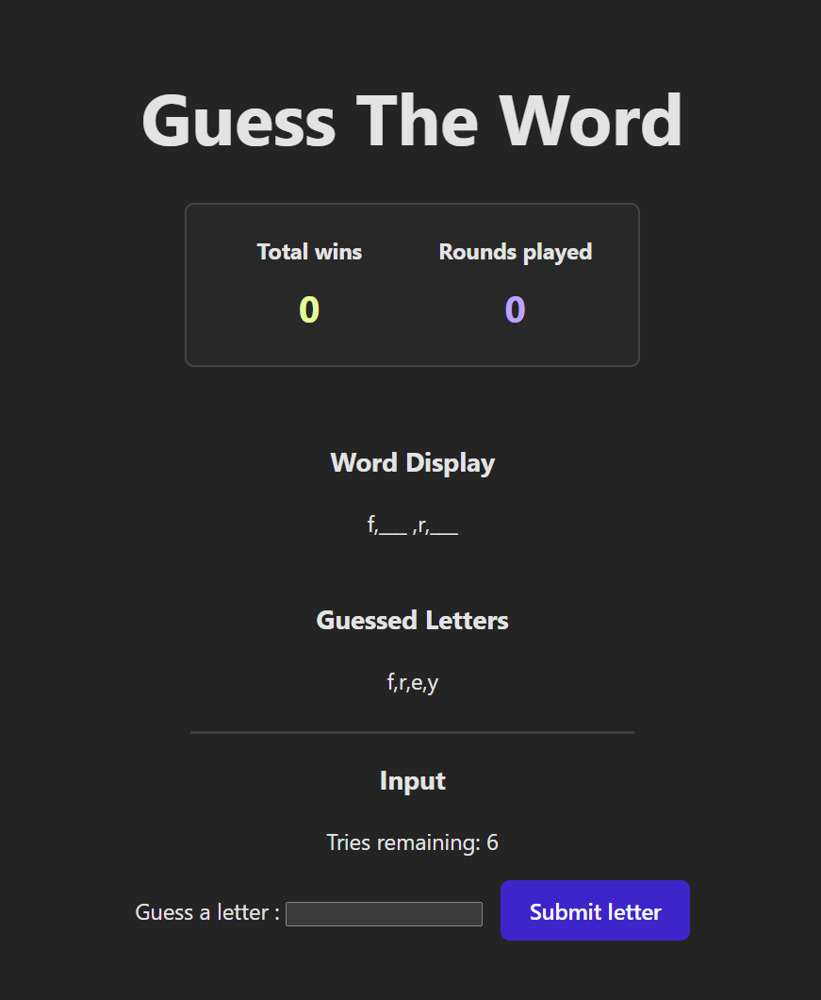

# Guess The Word
Try the Guess the Word game here: https://lamefreak.github.io/guess-the-word-3.2/



## Getting Started
Fork and clone the repo to your local machine.
```
git clone https://github.com/LAMEfreak/guess-the-word-3.2.git
```
This project was created using with Vitejs. In the project directory, please run the following commands:

`npm install`

`npm run dev`

The second command will run the app
To see the rendered output please open http://localhost:5173 in the browser of your choice, EG: Google Chrome.

The page will reload when you make changes.
You may also see any lint errors in the console.

## Instructions
- A mystery word is selected at random.
- Your objective is to figure out the mystery word by submitting guesses of a letter that may or may not be present in the mystery word.
- You win if you are able to figure out the word within 10 letter guesses.
- Your score across games can be viewed on the scoreboard.
- 
> [!NOTE]
> Add more words to `words.json` to expand the selection of random mystery words deployed for each game round.

## Technologies Used
- React
- HTML / CSS / JavaScript
- React Bootstrap
- canvas-confetti library by catdad
